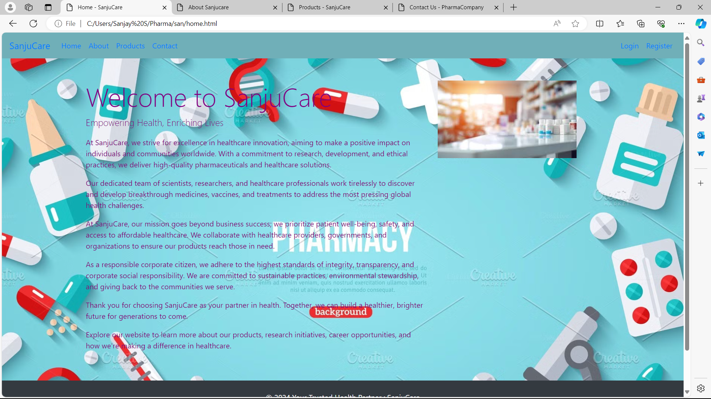
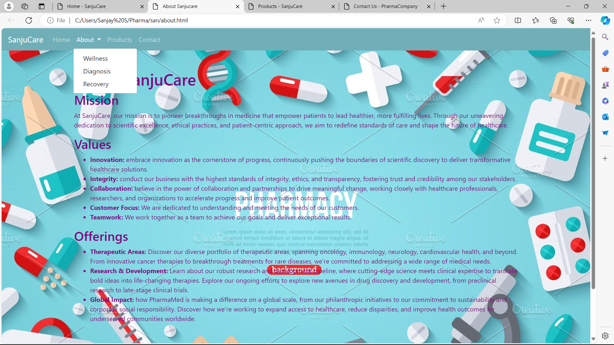
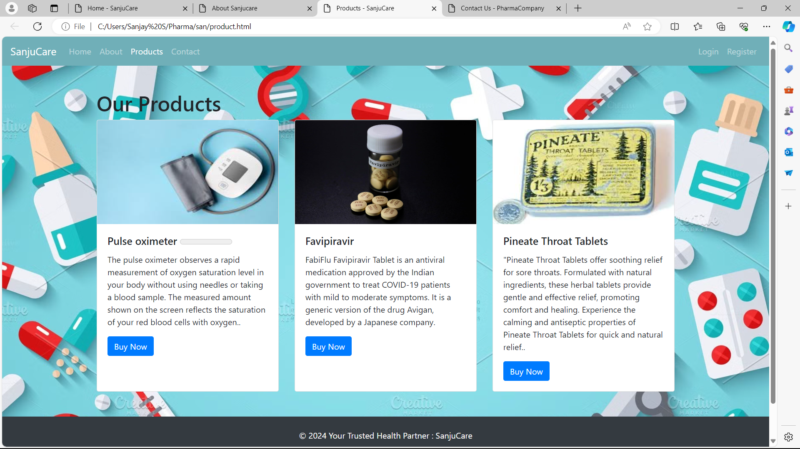
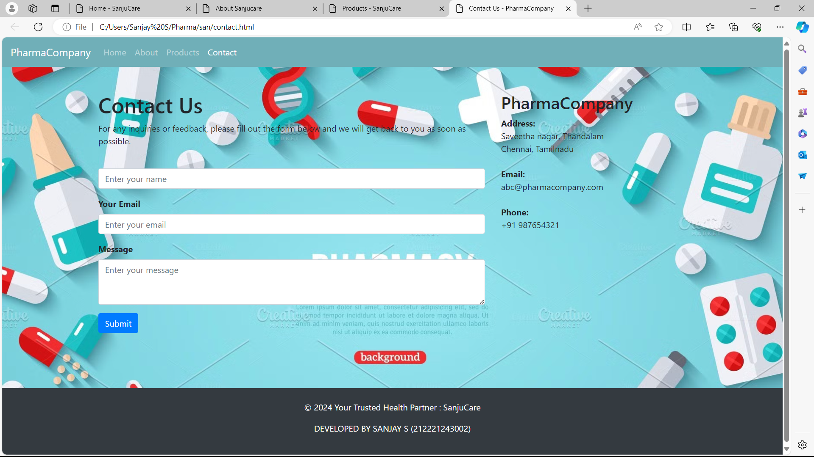

# Ex.10 Responsive Web Design using Bootstrap
## Date:15/05/2024

## AIM:
To design a responsive website for a Pharmaceutical Company using Bootstrap.


## DESIGN STEPS:

### Step 1:
Clone the repository from GitHub.

### Step 2:
Create Django Admin project.

### Step 3:
Create a New App under the Django Admin project.

### Step 4:
Insert the necessary CSS and JavaScript files as external in order to use Bootstrap.

### Step 5:
Create a HTML file and include the needed Bootstrap components.

### Step 6:
Publish the website in the LocalHost.

## PROGRAM :
### HOME
```HTML
<!DOCTYPE html>
<html lang="en">
<head>
  <meta charset="UTF-8">
  <meta name="viewport" content="width=device-width, initial-scale=1.0">
  <title>Home - SanjuCare</title>
  <link href="https://stackpath.bootstrapcdn.com/bootstrap/4.5.2/css/bootstrap.min.css" rel="stylesheet">
</head>
<body>
  <nav class="navbar navbar-expand-lg" style="background-color: rgb(112, 175, 184);">
    <a class="navbar-brand" href="#">SanjuCare</a>
    <button class="navbar-toggler" type="button" data-toggle="collapse" data-target="#navbarSupportedContent" aria-controls="navbarSupportedContent" aria-expanded="false" aria-label="Toggle navigation">
      <span class="navbar-toggler-icon"></span>
    </button>

    <div class="collapse navbar-collapse" id="navbarSupportedContent">
      <ul class="navbar-nav mr-auto">
        <li class="nav-item active">
          <a class="nav-link" href="home.html">Home <span class="sr-only">(current)</span></a>
        </li>
        <li class="nav-item">
          <a class="nav-link" href="about.html">About</a>
        </li>
        <li class="nav-item">
          <a class="nav-link" href="product.html">Products</a>
        </li>
        <li class="nav-item">
          <a class="nav-link" href="contact.html">Contact</a>
        </li>
      </ul>
      <ul class="navbar-nav ml-auto">
        <li class="nav-item">
          <a class="nav-link" href="#">Login</a>
        </li>
        <li class="nav-item">
          <a class="nav-link" href="#">Register</a>
        </li>
      </ul>
    </div>
  </nav>
  <div class="container mt-5" style="color: purple;">
    <div class="row">
      <div class="col-md-8">
        <h1 class="display-4">Welcome to SanjuCare</h1>
        <p class="lead">Empowering Health, Enriching Lives</p>
        <p>At SanjuCare, we strive for excellence in healthcare innovation, aiming to make a positive impact on individuals and communities worldwide. With a commitment to research, development, and ethical practices, we deliver high-quality pharmaceuticals and healthcare solutions.</p>
        <p>Our dedicated team of scientists, researchers, and healthcare professionals work tirelessly to discover and develop breakthrough medicines, vaccines, and treatments to address the most pressing global health challenges.</p>
        <p>At SanjuCare, our mission goes beyond business success; we prioritize patient well-being, safety, and access to affordable healthcare. We collaborate with healthcare providers, governments, and organizations to ensure our products reach those in need.</p>
        <p>As a responsible corporate citizen, we adhere to the highest standards of integrity, transparency, and corporate social responsibility. We are committed to sustainable practices, environmental stewardship, and giving back to the communities we serve.</p>
        <p>Thank you for choosing SanjuCare as your partner in health. Together, we can build a healthier, brighter future for generations to come.</p>
        <p>Explore our website to learn more about our products, research initiatives, career opportunities, and how we're making a difference in healthcare.</p>
      </div>
      <div class="col-md-4">
        
      </div>
    </div>
  </div>
  <body background="bg1.jpg" style="background-repeat: no-repeat; background-size: cover;">

  <footer class="bg-dark text-white text-center py-4 mt-5">
    <p>&copy; 2024 Your Trusted Health Partner : SanjuCare</p>
    <p>DEVELOPED BY SANJAY S (212221243002)</p>
  </footer>
  <script src="https://code.jquery.com/jquery-3.5.1.slim.min.js"></script>
  <script src="https://cdn.jsdelivr.net/npm/popper.js@1.16.1/dist/umd/popper.min.js"></script>
  <script src="https://stackpath.bootstrapcdn.com/bootstrap/4.5.2/js/bootstrap.min.js"></script>
</body>
</html>

```

### ABOUT
```HTML
<!DOCTYPE html>
<html lang="en">
<head>
  <meta charset="UTF-8">
  <meta name="viewport" content="width=device-width, initial-scale=1.0">
  <title>About Sanjucare</title>
  <link href="https://stackpath.bootstrapcdn.com/bootstrap/4.5.2/css/bootstrap.min.css" rel="stylesheet">
</head>
<body>
  <nav class="navbar navbar-expand-lg navbar-dark" style="background-color: rgb(112, 175, 184);">
    <a class="navbar-brand" href="#">SanjuCare</a>
    <button class="navbar-toggler" type="button" data-toggle="collapse" data-target="#navbarSupportedContent" aria-controls="navbarSupportedContent" aria-expanded="false" aria-label="Toggle navigation">
      <span class="navbar-toggler-icon"></span>
    </button>

    <div class="collapse navbar-collapse" id="navbarSupportedContent">
      <ul class="navbar-nav mr-auto">
        <li class="nav-item">
          <a class="nav-link" href="home.html">Home</a>
        </li>
        <li class="nav-item dropdown active">
          <a class="nav-link dropdown-toggle" href="about.html" id="navbarDropdownAbout" role="button" data-toggle="dropdown" aria-haspopup="true" aria-expanded="false">
            About
          </a>
          <div class="dropdown-menu" aria-labelledby="navbarDropdownAbout">
            <a class="dropdown-item" href="#vision">Wellness</a>
            <a class="dropdown-item" href="#mission">Diagnosis</a>
            <a class="dropdown-item" href="#values">Recovery</a>
          </div>
        </li>
        <li class="nav-item">
          <a class="nav-link" href="product.html">Products</a>
        </li>
        <li class="nav-item">
          <a class="nav-link" href="#">Contact</a>
        </li>
      </ul>
    </div>
  </nav>
  <div class="container mt-5" style="color: purple;">
    <div class="row">
      <div class="col-md-12">
        <h1>About SanjuCare</h1>
        <div id="mission">
          <h2>Mission</h2>
          <p>At SanjuCare, our mission is to pioneer breakthroughs in medicine that empower patients to lead healthier, more fulfilling lives. Through our unwavering dedication to scientific excellence, ethical practices, and patient-centric approach, we aim to redefine standards of care and shape the future of healthcare.</p>
        </div>
        <div id="values">
          <h2>Values</h2>
          <ul>
            <li><b>Innovation: </b> embrace innovation as the cornerstone of progress, continuously pushing the boundaries of scientific discovery to deliver transformative healthcare solutions.</li>
            <li><b>Integrity: </b> conduct our business with the highest standards of integrity, ethics, and transparency, fostering trust and credibility among our stakeholders.</li>
            <li><b>Collaboration: </b> believe in the power of collaboration and partnerships to drive meaningful change, working closely with healthcare professionals, researchers, and organizations to accelerate progress and improve patient outcomes.</li>
            <li><b>Customer Focus:</b> We are dedicated to understanding and meeting the needs of our customers.</li>
            <li><b>Teamwork:</b> We work together as a team to achieve our goals and deliver exceptional results.</li>
          </ul>
        </div>
        <div id="Offerings">
            <h2>Offerings</h2>
            <ul>
              <li><b>Therapeutic Areas:</b> Discover our diverse portfolio of therapeutic areas, spanning oncology, immunology, neurology, cardiovascular health, and beyond. From innovative cancer therapies to breakthrough treatments for rare diseases, we're committed to addressing a wide range of medical needs.</li>
              <li><b>Research & Development:</b> Learn about our robust research and development pipeline, where cutting-edge science meets clinical expertise to translate bold ideas into life-changing therapies. Explore our ongoing efforts to explore new avenues in drug discovery and development, from preclinical research to late-stage clinical trials.</li>
              <li><b>Global Impact: </b> how PharmaMed is making a difference on a global scale, from our philanthropic initiatives to our commitment to sustainability and corporate social responsibility. Discover how we're working to expand access to healthcare, reduce disparities, and improve health outcomes for underserved communities worldwide.</li>
            </ul>
          </div>
      </div>
    </div>
  </div>
  <body background="bg1.jpg" style="background-repeat: no-repeat; background-size: cover;">
  <footer class="bg-dark text-white text-center py-4 mt-5">
    <p>&copy; 2024 Your Trusted Health Partner : SanjuCare</p>
    <p>DEVELOPED BY SANJAY S (212221243002)</p>
  </footer>
  <script src="https://code.jquery.com/jquery-3.5.1.slim.min.js"></script>
  <script src="https://cdn.jsdelivr.net/npm/popper.js@1.16.1/dist/umd/popper.min.js"></script>
  <script src="https://stackpath.bootstrapcdn.com/bootstrap/4.5.2/js/bootstrap.min.js"></script>
</body>
</html>

```

### PRODUCT
```HTML
<!DOCTYPE html>
<html lang="en">
<head>
  <meta charset="UTF-8">
  <meta name="viewport" content="width=device-width, initial-scale=1.0">
  <title>Products - SanjuCare</title>
  <link href="https://stackpath.bootstrapcdn.com/bootstrap/4.5.2/css/bootstrap.min.css" rel="stylesheet">
</head>
<body>
  <nav class="navbar navbar-expand-lg navbar-dark" style="background-color: rgb(112, 175, 184);">
    <a class="navbar-brand" href="#">SanjuCare</a>
    <button class="navbar-toggler" type="button" data-toggle="collapse" data-target="#navbarSupportedContent" aria-controls="navbarSupportedContent" aria-expanded="false" aria-label="Toggle navigation">
      <span class="navbar-toggler-icon"></span>
    </button>
    <div class="collapse navbar-collapse" id="navbarSupportedContent">
      <ul class="navbar-nav mr-auto">
        <li class="nav-item">
          <a class="nav-link" href="web.html">Home</a>
        </li>
        <li class="nav-item">
          <a class="nav-link" href="about.html">About</a>
        </li>
        <li class="nav-item active">
          <a class="nav-link" href="product.html">Products <span class="sr-only">(current)</span></a>
        </li>
        <li class="nav-item">
          <a class="nav-link" href="contact.html">Contact</a>
        </li>
      </ul>
      <ul class="navbar-nav ml-auto">
        <li class="nav-item">
          <a class="nav-link" href="#">Login</a>
        </li>
        <li class="nav-item">
          <a class="nav-link" href="#">Register</a>
        </li>
      </ul>
    </div>
  </nav>

  <div class="container mt-5">
    <div class="row">
      <div class="col-md-12">
        <h1>Our Products</h1>
        <div class="card-deck">
          <div class="card">
            
            <div class="card-body">
              <h5 class="card-title">Pulse oximeter <meter value=""></meter></h5>
              <p class="card-text">The pulse oximeter observes a rapid measurement of oxygen saturation level in your body without using needles or taking a blood sample. The measured amount shown on the screen reflects the saturation of your red blood cells with oxygen..</p>
              <a href="#" class="btn btn-primary">Buy Now</a>
            </div>
          </div>
          <div class="card">
            
            <div class="card-body">
              <h5 class="card-title">Favipiravir</h5>
              <p class="card-text">FabiFlu Favipiravir Tablet is an antiviral medication approved by the Indian government to treat COVID-19 patients with mild to moderate symptoms. It is a generic version of the drug Avigan, developed by a Japanese company.</p>
              <a href="#" class="btn btn-primary">Buy Now</a>
            </div>
          </div>
          <div class="card">
            
            <div class="card-body">
              <h5 class="card-title">Pineate Throat Tablets</h5>
              <p class="card-text">"Pineate Throat Tablets offer soothing relief for sore throats. Formulated with natural ingredients, these herbal tablets provide gentle and effective relief, promoting comfort and healing. Experience the calming and antiseptic properties of Pineate Throat Tablets for quick and natural relief..</p>
              <a href="#" class="btn btn-primary">Buy Now</a>
            </div>
          </div>
        </div>
      </div>
    </div>
  </div>
  <footer class="bg-dark text-white text-center py-4 mt-5">
    <p>&copy; 2024 Your Trusted Health Partner : SanjuCare</p>
    <p>DEVELOPED BY SANJAY S (212221243002)</p>
  </footer>
  <body background="bg1.jpg" style="background-repeat: no-repeat; background-size: cover;">

  <script src="https://code.jquery.com/jquery-3.5.1.slim.min.js"></script>
  <script src="https://cdn.jsdelivr.net/npm/popper.js@1.16.1/dist/umd/popper.min.js"></script>
  <script src="https://stackpath.bootstrapcdn.com/bootstrap/4.5.2/js/bootstrap.min.js"></script>
</body>
</html>

```

### CONTACT
```HTML
<!DOCTYPE html>
<html lang="en">
<head>
  <meta charset="UTF-8">
  <meta name="viewport" content="width=device-width, initial-scale=1.0">
  <title>Contact Us - PharmaCompany</title>
  <link href="https://stackpath.bootstrapcdn.com/bootstrap/4.5.2/css/bootstrap.min.css" rel="stylesheet">
</head>
<body>
  <nav class="navbar navbar-expand-lg navbar-dark" style="background-color: rgb(112, 175, 184);">
    <a class="navbar-brand text-purple" href="#">PharmaCompany</a>
    <button class="navbar-toggler" type="button" data-toggle="collapse" data-target="#navbarSupportedContent" aria-controls="navbarSupportedContent" aria-expanded="false" aria-label="Toggle navigation">
      <span class="navbar-toggler-icon"></span>
    </button>

    <div class="collapse navbar-collapse" id="navbarSupportedContent">
      <ul class="navbar-nav mr-auto">
        <li class="nav-item">
          <a class="nav-link text-purple" href="web.html">Home</a>
        </li>
        <li class="nav-item">
          <a class="nav-link text-purple" href="about.html">About</a>
        </li>
        <li class="nav-item">
          <a class="nav-link text-purple" href="product.html">Products</a>
        </li>
        <li class="nav-item active">
          <a class="nav-link text-purple" href="contact.html">Contact <span class="sr-only">(current)</span></a>
        </li>
      </ul>
    </div>
  </nav>
  <div class="container mt-5">
    <div class="row">
      <div class="col-md-8">
        <h1 class="text-purple">Contact Us</h1>
        <p class="text-purple">For any inquiries or feedback, please fill out the form below and we will get back to you as soon as possible.</p>
        <form>
          <div class="form-group">
            <label for="name" class="text-purple"><b></b></label>
            <input type="text" class="form-control" id="name" placeholder="Enter your name">
          </div>
          <div class="form-group">
            <label for="email" class="text-purple"><b>Your Email</b></label>
            <input type="email" class="form-control" id="email" placeholder="Enter your email">
          </div>
          <div class="form-group">
            <label for="message" class="text-purple"><b>Message</b></label>
            <textarea class="form-control" id="message" rows="3" placeholder="Enter your message"></textarea>
          </div>
          <button type="submit" class="btn btn-primary">Submit</button>
        </form>
      </div>
      <div class="col-md-4">
        <h2 class="text-purple">PharmaCompany</h2>
        <address class="text-purple">
          <strong>Address:</strong><br>
          Saveetha nagar, Thandalam<br>
          Chennai, Tamilnadu<br><br>
          <strong>Email:</strong><br>
          abc@pharmacompany.com<br><br>
          <strong>Phone:</strong><br>
          +91 987654321
        </address>
      </div>
    </div>
  </div>
  <body background="bg1.jpg" style="background-repeat: no-repeat; background-size: cover;"><br><br><br><br>
  <footer class="bg-dark text-white text-center py-4 mt-2">
    <p class="text-purple">&copy; 2024 Your Trusted Health Partner : SanjuCare</p>
    <p class="text-purple">DEVELOPED BY SANJAY S (212221243002)</p>
  </footer>
  <script src="https://code.jquery.com/jquery-3.5.1.slim.min.js"></script>
  <script src="https://cdn.jsdelivr.net/npm/popper.js@1.16.1/dist/umd/popper.min.js"></script>
  <script src="https://stackpath.bootstrapcdn.com/bootstrap/4.5.2/js/bootstrap.min.js"></script>
</body>
</html>

```

## OUTPUT:








## RESULT:
The program for responsive web design using Bootstrap is completed successfully.
